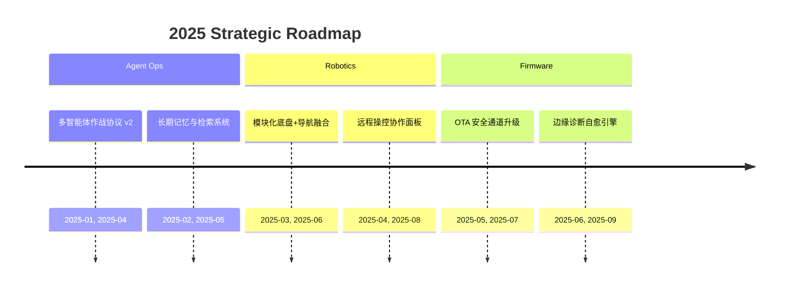

<!-- README.md -->

<h3 style="margin-top: -80px;">🔒 UEG 机密档案 // CLASSIFIED</h3>

### ⚡ Operation · Eric-Terminal

部署于 **UEG 高级技术开发部** 的自主智能系统特勤官，主导 <kbd>AI Agents</kbd>、<kbd>机器人链路</kbd> 与 <kbd>嵌入式固件</kbd> 的端到端任务编排。

_"今人不见古时月，今月曾经照古人"_

  

---

## **⚡ 指挥控制台 // COMMAND CONSOLE**

  <table>
    <tr>
      <td width="360" align="center">
        <h3>⚡ 智能体矩阵</h3>
        
自研多 Agent 指挥栈，涵盖规划、联网工具链、知识图谱同步。

        
      </td>
      <td width="360" align="center">
        <h3>🤖 机器人中枢</h3>
        
融合 SLAM、感知与驱动固件，打造室内外协同机器人系统。

        
      </td>
      <td width="360" align="center">
        <h3>🛰️ 嵌入式联络</h3>
        
定制固件与 OTA 框架，保障边缘节点与云端指挥的实时同步。

        
      </td>
    </tr>
  </table>

---

## **📋 档案详情 // PROFILE DOSSIER**

  <table>
    <tr>
      <td><b>安全许可等级</b></td>
      <td><code>IV (Top Secret)</code></td>
      <td><b>行动代号</b></td>
      <td><code>Eric-Terminal</code></td>
    </tr>
    <tr>
      <td><b>当前状态</b></td>
      <td><b>活跃 (Active)</b></td>
      <td><b>所属部门</b></td>
      <td>高级技术开发部</td>
    </tr>
    <tr>
      <td><b>专长领域</b></td>
      <td colspan="3">AI 应用开发, 多智能体系统, 固件定制</td>
    </tr>
    <tr>
      <td><b>注册日期</b></td>
      <td><code>2022-12-25</code></td>
      <td><b>主要语言</b></td>
      <td>Swift, Python, C/C++</td>
    </tr>
  </table>

---

## **📖 战术总纲 // INTELLIGENCE BRIEFING**

> ### **快速态势更新**
> 
> - 部署可扩展 Agent Mesh，实现 LLM 协同、自主工具调用与安全审计。
> - 沉迷大模型与提示词工程，迭代多模态指令集和 CoT/ToT 设计，挖掘任务边界。
> - 研发跨平台机器人控制栈，打通仿真、感知与实际出勤的闭环。
> - 搭建低功耗边缘固件链路，确保长周期任务的稳定性与轮换维护。

---

## **🗺️ 行动路线图 // MISSION ROADMAP**

---

## **🔧 技术能力矩阵 // TECH OPERATIONS MATRIX**

  <table>
    <tr>
      <td width="360" align="center">
        <h3>💻 核心语言</h3>
        
          
        
      </td>
      <td width="360" align="center">
        <h3>🛠️ 工具矩阵</h3>
        
          
        
      </td>
      <td width="360" align="center">
        <h3>⚙️ 研发环境</h3>
        
        
          
        
      </td>
    </tr>
  </table>

---

## **📊 行为数据分析 // TELEMETRY**

  <table>
    <tr>
      <td width="360" align="center">
        <h3>🏆 功勋奖章</h3>
        
      </td>
      <td width="360" align="center">
        <h3>📈 作战数据</h3>
        <picture>
          <source media="(prefers-color-scheme: dark)" srcset="https://github-readme-stats.vercel.app/api?username=Eric-Terminal&show_icons=true&bg_color=0d1117&text_color=ffffff&title_color=52c1ff&icon_color=52c1ff&border_color=1c2b45&count_private=true">
          <source media="(prefers-color-scheme: light)" srcset="https://github-readme-stats.vercel.app/api?username=Eric-Terminal&show_icons=true&bg_color=ffffff&text_color=444&title_color=2f81f7&icon_color=2f81f7&border_color=e1e4e8&count_private=true">
          
        </picture>
      </td>
      <td width="360" align="center">
        <h3>📊 情报占比</h3>
        <picture>
          <source media="(prefers-color-scheme: dark)" srcset="https://github-readme-stats.vercel.app/api/top-langs/?username=Eric-Terminal&layout=compact&bg_color=0d1117&text_color=ffffff&title_color=52c1ff&border_color=1c2b45">
          <source media="(prefers-color-scheme: light)" srcset="https://github-readme-stats.vercel.app/api/top-langs/?username=Eric-Terminal&layout=compact&bg_color=ffffff&text_color=444&title_color=2f81f7&border_color=e1e4e8">
          
        </picture>
      </td>
    </tr>
  </table>

 

  

 

  

---

## **📝 近期活动日志 // RECENT ACTIVITY LOG**

> *由指挥中心自动记录，同步特勤人员的公开任务动向。*

<!-- activity:START -->> Eric-Terminal opened a pull request in Darock-Bili$ - `(Fri Jan 02 2026 9:11 AM$)`> Eric-Terminal pushed ETOS-LLM-Studio$ - `(Fri Jan 02 2026 7:19 AM$)`> Eric-Terminal pushed ETOS-LLM-Studio$ - `(Fri Jan 02 2026 6:21 AM$)`> Eric-Terminal pushed Xianyu-OrderVisualization$ - `(Thu Jan 01 2026 8:25 PM$)`> Eric-Terminal added Eric-Terminal to xiaoxiao-cvs/Xianyu-OrderVisualization$ - `(Thu Jan 01 2026 8:00 PM$)`<!-- activity:END -->

---

## **📡 通讯信道 // CONTACT CHANNEL**

  
  
  
  

 

<em>档案记录完毕 // END OF RECORD</em>

