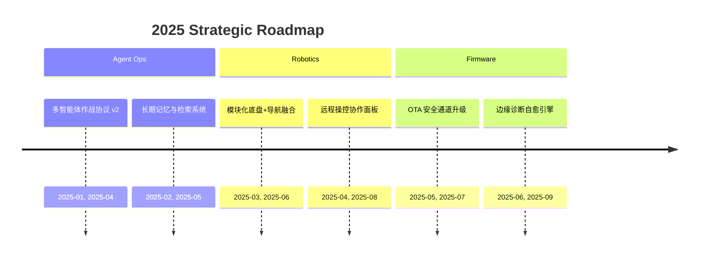

<!-- README.md -->

  

    

      
    

    

      <h1 style="margin:0 0 12px;font-size:34px;letter-spacing:1px;">UEG 机密档案 // CLASSIFIED</h1>
      
      <h2 style="margin:0 0 18px;font-size:26px;color:#BDE3FF;">Operation · Eric-Terminal</h2>
      
部署于 <strong>UEG 高级技术开发部</strong> 的自主智能系统特勤官，主导 <kbd>AI Agents</kbd>、<kbd>机器人链路</kbd> 与 <kbd>嵌入式固件</kbd> 的端到端任务编排。

      
行动准则：<em>“今人不见古时月，今月曾经照古人”</em>

      

        🟢 Current Status · Active
        🔐 Clearance · Level IV
        🚀 Mission Focus · AI Automation
        🧠 LLM & Prompt Crafting
      

    

    

      

        
      

    

  

  <a href="https://ericterminal.com" style="display:inline-flex;align-items:center;gap:10px;padding:12px 26px;border-radius:26px;background:linear-gradient(135deg,rgba(80,180,255,0.25),rgba(30,120,220,0.45));color:#EAF4FF;text-decoration:none;font-weight:600;letter-spacing:0.5px;border:1px solid rgba(120,200,255,0.35);box-shadow:0 18px 40px rgba(18,62,128,0.45);backdrop-filter:blur(14px);">
    🛰️ 指挥基地 · ericterminal.com
  </a>

---

## **指挥控制台 // COMMAND CONSOLE**

  

    

      

        <h3>⚡ 智能体矩阵</h3>
        
自研多 Agent 指挥栈，涵盖规划、联网工具链、知识图谱同步。

        <a href="https://github.com/Eric-Terminal/ETOS-LLM-Studio" style="display:inline-flex;align-items:center;gap:10px;padding:10px 22px;border-radius:22px;background:linear-gradient(135deg,rgba(108,189,255,0.25),rgba(54,128,228,0.4));color:#EAF4FF;text-decoration:none;font-weight:600;border:1px solid rgba(118,198,255,0.35);box-shadow:0 14px 30px rgba(20,70,150,0.4);">
          ⟶ 访问 ETOS LLM Studio
        </a>
      

      

        <h3>🤖 机器人中枢</h3>
        
融合 SLAM、感知与驱动固件，打造室内外协同机器人系统。

        <a href="https://github.com/Eric-Terminal?tab=repositories&q=robot" style="display:inline-flex;align-items:center;gap:10px;padding:10px 22px;border-radius:22px;background:linear-gradient(135deg,rgba(118,210,255,0.26),rgba(42,132,228,0.38));color:#EAF4FF;text-decoration:none;font-weight:600;border:1px solid rgba(120,206,255,0.34);box-shadow:0 14px 30px rgba(12,52,122,0.45);">
          ⟶ 机器人项目追踪
        </a>
      

      

        <h3>🛰️ 嵌入式联络</h3>
        
定制固件与 OTA 框架，保障边缘节点与云端指挥的实时同步。

        <a href="https://github.com/Eric-Terminal?tab=repositories&q=firmware" style="display:inline-flex;align-items:center;gap:10px;padding:10px 22px;border-radius:22px;background:linear-gradient(135deg,rgba(130,220,255,0.26),rgba(36,140,214,0.36));color:#EAF4FF;text-decoration:none;font-weight:600;border:1px solid rgba(120,210,255,0.34);box-shadow:0 14px 30px rgba(12,60,128,0.45);">
          ⟶ 固件实验室
        </a>
      

    

  

---

## **档案详情 // PROFILE DOSSIER**

  

    <table style="width:100%;border-collapse:separate;border-spacing:14px;color:#EAF4FF;">
      <tr>
        <td style="font-weight:600;">安全许可等级</td>
        <td style="font-weight:600;">IV (Top Secret)</td>
        <td style="font-weight:600;">行动代号</td>
        <td><code>Eric-Terminal</code></td>
      </tr>
      <tr>
        <td style="font-weight:600;">当前状态</td>
        <td style="font-weight:600;">活跃 (Active)</td>
        <td style="font-weight:600;">所属部门</td>
        <td>高级技术开发部</td>
      </tr>
      <tr>
        <td style="font-weight:600;">专长领域</td>
        <td>AI 应用开发, 多智能体系统, 固件定制</td>
        <td style="font-weight:600;">注册日期</td>
        <td>2022-12-25</td>
      </tr>
    </table>
  

---

## **战术总纲 // INTELLIGENCE BRIEFING**

  

    

      
<strong>快速态势更新</strong>

      <ul>
        <li>部署可扩展 Agent Mesh，实现 LLM 协同、自主工具调用与安全审计。</li>
        <li>沉迷大模型与提示词工程，迭代多模态指令集和 CoT/ToT 设计，挖掘任务边界。</li>
        <li>研发跨平台机器人控制栈，打通仿真、感知与实际出勤的闭环。</li>
        <li>搭建低功耗边缘固件链路，确保长周期任务的稳定性与轮换维护。</li>
      </ul>
    

  

---

## **行动路线图 // MISSION ROADMAP**

---

## **技术能力矩阵 // TECH OPERATIONS MATRIX**

  

  

    

      <h3>核心语言</h3>
      
      

        Prompt Engineering · ★★★★★
      

    

    

      <h3>工具矩阵</h3>
      
      

        Agent Ops & LLM Ops · ★★★★★
      

    

    

      <h3>研发环境</h3>
      

        
        
        
        
      

      

        Edge Firmware · ★★★★☆
      

    

  

  

---

## **行为数据分析 // TELEMETRY**

  

    

      

        <strong>功勋奖章</strong> 
        
      

      

        <strong>作战数据</strong> 
        <picture>
          <source media="(prefers-color-scheme: dark)" srcset="https://github-readme-stats.vercel.app/api?username=Eric-Terminal&show_icons=true&bg_color=0d1117&text_color=ffffff&title_color=52c1ff&icon_color=52c1ff&border_color=1c2b45&count_private=true">
          <source media="(prefers-color-scheme: light)" srcset="https://github-readme-stats.vercel.app/api?username=Eric-Terminal&show_icons=true&bg_color=ffffff&text_color=444&title_color=2f81f7&icon_color=2f81f7&border_color=e1e4e8&count_private=true">
          
        </picture>
      

      

        <strong>情报占比</strong> 
        <picture>
          <source media="(prefers-color-scheme: dark)" srcset="https://github-readme-stats.vercel.app/api/top-langs/?username=Eric-Terminal&layout=compact&bg_color=0d1117&text_color=ffffff&title_color=52c1ff&border_color=1c2b45">
          <source media="(prefers-color-scheme: light)" srcset="https://github-readme-stats.vercel.app/api/top-langs/?username=Eric-Terminal&layout=compact&bg_color=ffffff&text_color=444&title_color=2f81f7&border_color=e1e4e8">
          
        </picture>
      

    

  

  

  

---

## **近期活动日志 // RECENT ACTIVITY LOG**
*由指挥中心自动记录，同步特勤人员的公开任务动向。*

  

    <!--START_SECTION:activity-->
    <!--END_SECTION:activity-->
  

---

## **通讯信道 // CONTACT CHANNEL**

  

    <a href="mailto:eric-terminal@qq.com" style="display:inline-flex;align-items:center;gap:10px;padding:12px 24px;border-radius:26px;background:linear-gradient(135deg,rgba(112,200,255,0.22),rgba(44,135,220,0.38));color:#EAF4FF;text-decoration:none;font-weight:600;border:1px solid rgba(118,198,255,0.35);box-shadow:0 18px 40px rgba(18,62,128,0.45);">
      ✉️ 建立安全通讯
    </a>
    <a href="https://space.bilibili.com/405543288" style="display:inline-flex;align-items:center;gap:10px;padding:12px 24px;border-radius:26px;background:linear-gradient(135deg,rgba(118,220,255,0.24),rgba(52,150,232,0.36));color:#EAF4FF;text-decoration:none;font-weight:600;border:1px solid rgba(122,206,255,0.34);box-shadow:0 18px 40px rgba(16,70,140,0.45);">
      📡 情报广播 · Bilibili
    </a>
    <a href="https://github.com/Eric-Terminal?tab=followers" style="display:inline-flex;align-items:center;gap:10px;padding:12px 24px;border-radius:26px;background:linear-gradient(135deg,rgba(120,220,255,0.22),rgba(38,126,210,0.36));color:#EAF4FF;text-decoration:none;font-weight:600;border:1px solid rgba(112,198,255,0.34);box-shadow:0 18px 40px rgba(14,62,128,0.45);">
      🤝 加入情报网络
    </a>
    <a href="https://github.com/Eric-Terminal?tab=repositories" style="display:inline-flex;align-items:center;gap:10px;padding:12px 24px;border-radius:26px;background:linear-gradient(135deg,rgba(126,225,255,0.24),rgba(46,138,220,0.36));color:#EAF4FF;text-decoration:none;font-weight:600;border:1px solid rgba(118,202,255,0.34);box-shadow:0 18px 40px rgba(16,66,132,0.45);">
      🗃️ 探索任务仓库
    </a>
  

档案记录完毕 // END OF RECORD

