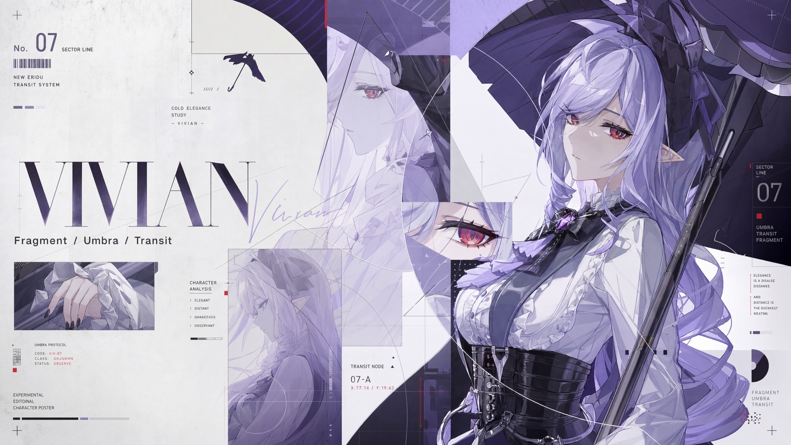

<!-- README.md -->
### 关于我

> *刃は鞘に、心は花に*

喜欢终端那种硬核的界面风格，爱用CLI程序，故名Eric-Terminal。

讨厌虚假的营销套路和空洞的概念，喜欢把硬核的东西研究透，不然心里会一直憋着。

旗舰项目应该是做了个跨平台大模型客户端 [ETOS LLM Studio](https://github.com/Eric-Terminal/ETOS-LLM-Studio)，Swift写的，因为watchOS上面没有功能全的AI客户端，而我又喜欢随时随地有问题问AI，在学校只有手表，所以就做了这个

博客没什么时间用电脑发，又给博客写了个MCP接口，现在手表直接推文章。

喜欢研究底层的东西：密码学（从RSA的大数分解到ECC的椭圆曲线群、Dragonfly握手等等）、各种RFC标准、比如OSI七层各种协议全贯通，还有AI相关的Transformer架构etc.

垃圾佬，把电视盒子刷成 Armbian、路由器刷成 OpenWrt，性能压榨到极致。也是HAM，有空就扫一扫频谱。

非常喜欢用AI，追求全面自动化，每天和AI讲的话比和人讲的多。

激进的Vibe Coding派程序员，很久没有亲手写过代码了，喜欢编译型语言。

最喜欢一句话：**没枪，和有枪不用，是两码事。**

折腾的事情大部分都写在 **[博客](https://blog.ericterminal.com)** 里了，README 放不下。

---

<div align="center">
  
  <p style="font-size: 14px; font-weight: bold; color: #ff69b4; margin-top: 10px;">
    <i>💖 我在这里宣布 Vivian 是我老婆 💖</i>
  </p>
</div>

---

### 技术栈

<div align="center">
  
</div>

<br>

**语言**


**平台 & 工具**


**安全 & 逆向**


---

### 统计

<div align="center">
  
</div>

<br>

<div align="center">
  <picture>
    <source media="(prefers-color-scheme: dark)" srcset="https://github-readme-activity-graph.vercel.app/graph?username=Eric-Terminal&radius=18&theme=github-dark&area=true&hide_border=true">
    <source media="(prefers-color-scheme: light)" srcset="https://github-readme-activity-graph.vercel.app/graph?username=Eric-Terminal&radius=18&theme=github&area=true&hide_border=true">
    
  </picture>
</div>

<div align="center">
  
</div>

---

### 近期动态

<div align="center">

<!-- activity:START -->
- [Eric-Terminal pushed cloudflare-pages](https://github.com/Eric-Terminal/cloudflare-pages/compare/bf0c763493...28f886e578)
- [Eric-Terminal pushed ETOS-LLM-Studio](https://github.com/Eric-Terminal/ETOS-LLM-Studio/compare/8cbd549227...1779a4597f)
- [Eric-Terminal pushed ETOS-LLM-Studio](https://github.com/Eric-Terminal/ETOS-LLM-Studio/compare/8cbd549227...1779a4597f)
- [Eric-Terminal pushed dotfiles](https://github.com/Eric-Terminal/dotfiles/compare/9c443e583f...f58a342e10)
- [Eric-Terminal pushed ETOS-LLM-Studio](https://github.com/Eric-Terminal/ETOS-LLM-Studio/compare/4b7f15e895...8cbd549227)
<!-- activity:END -->

</div>

---

<div align="center">

*水無月の誰彼時、晩暉に染まる結びの糸*

*六月薄暮冥冥时，余晖尽染结缘丝*

</div>

---

### GPG 公钥

如需加密通信，欢迎使用以下公钥：

**指纹：** `DDFF BE9D 6D4A DA9C D70B C36D 8C9D D07C 93ED F17F`

<details>
<summary>📋 展开查看完整公钥</summary>

```
-----BEGIN PGP PUBLIC KEY BLOCK-----

mDMEaYi8xhYJKwYBBAHaRw8BAQdAHfSglzzx32Ra1Xe7fthY3cjGlTzpyzpZsiXp
w57+jEy0JkVyaWMgVGVybWluYWwgPGVyaWN0ZXJtaW5hbEBnbWFpbC5jb20+iLIE
ExYKAFobFIAAAAAABAAObWFudTIsMi41KzEuMTIsMCwzAhsDBQsJCAcCAiICBhUK
CQgLAgQWAgMBAh4HAheAFiEE3f++nW1K2pzXC8NtjJ3QfJPt8X8FAmm9kFcCGQEA
CgkQjJ3QfJPt8X8GOAD/aJF5yIapnqYAy4zgqEgTxL1R+EWMYODqPvbfBVV8Wk8A
/RuKBgRlREgYfBa+Bhx2S1awW5VBc5ZKXZneZYyaTSEBtChFcmljIFRlcm1pbmFs
IDxlcmljdGVybWluYWxAb3V0bG9vay5jb20+iK8EExYKAFcWIQTd/76dbUranNcL
w22MndB8k+3xfwUCab2P5RsUgAAAAAAEAA5tYW51MiwyLjUrMS4xMiwwLDMCGwMF
CwkIBwICIgIGFQoJCAsCBBYCAwECHgcCF4AACgkQjJ3QfJPt8X9F7gD/dnozo6dD
wo+4W+Yzk7mYWL9bT7JN3SQnKvqafXNMjk8A/34ja7e8sNxfdKl1sTrsAO2JnFYy
TN9UJ5at2rBuJRUFtC1FcmljIFRlcm1pbmFsIDxlcmljdGVybWluYWxAZXJpY3Rl
cm1pbmFsLmNvbT6IrwQTFgoAVxYhBN3/vp1tStqc1wvDbYyd0HyT7fF/BQJpvY/q
GxSAAAAAAAQADm1hbnUyLDIuNSsxLjEyLDAsMwIbAwULCQgHAgIiAgYVCgkICwIE
FgIDAQIeBwIXgAAKCRCMndB8k+3xf50EAP9FpNsssnm0c6zsoz6Yza53Uj+5raWs
LXEodYpNFuMLgwD+P8A0t4yuzA17rTWFFZKl1HM+gFF92h/TRyWnVVQRJQ20J0Vy
aWMgVGVybWluYWwgPGVyaWN0ZXJtaW5hbEBpY2xvdWQuY29tPoivBBMWCgBXFiEE
3f++nW1K2pzXC8NtjJ3QfJPt8X8FAmm9j+8bFIAAAAAABAAObWFudTIsMi41KzEu
MTIsMCwzAhsDBQsJCAcCAiICBhUKCQgLAgQWAgMBAh4HAheAAAoJEIyd0HyT7fF/
EU8BAL8XYM6FlBQO4V+gvxlyCYbDPLffsz4m2y+oRALU+b4DAQCzEH2CmjkaJa5W
Yd0ns2EVO+6t5LevuPOCVcjcq7VpCLQhWXVmYW4gQ2hlbiA8eXVmYW4uY2hlbkBs
aW51eC5kZXY+iK8EExYKAFcWIQTd/76dbUranNcLw22MndB8k+3xfwUCacS1pRsU
gAAAAAAEAA5tYW51MiwyLjUrMS4xMiwwLDMCGwMFCwkIBwICIgIGFQoJCAsCBBYC
AwECHgcCF4AACgkQjJ3QfJPt8X8+EwEAyT4kWo2QHZZ6xLXFmpkeW+obI899Loul
t9WRsjmersEBAJQ7y9kw7LkP1u1+taNItAKfaKgUBQsv4RL6GxTiZnUBuDgEaYi8
xhIKKwYBBAGXVQEFAQEHQK0G5+Yt1061ISpaBCPUqOttbECfUZM3UqQ+AHKIE95V
AwEIB4h4BBgWCgAgFiEE3f++nW1K2pzXC8NtjJ3QfJPt8X8FAmmIvMYCGwwACgkQ
jJ3QfJPt8X8pdAD+OYYMBWWBaE9UiwBvDuH2hThmjJ327VDAuCrqMDYux9AA/2n2
/TCkzRh+Ug2qEFP4mWOVoyyTsSfiPrvxz0QzQl0O
=E+Y9
-----END PGP PUBLIC KEY BLOCK-----
```

</details>

---

<div align="center">
  <p>
    <a href="mailto:ericterminal@gmail.com">
      
    </a>
    <a href="https://blog.ericterminal.com">
      
    </a>
    <a href="https://ericterminal.com">
      
    </a>
    <a href="https://space.bilibili.com/405543288">
      
    </a>
  </p>
</div>


